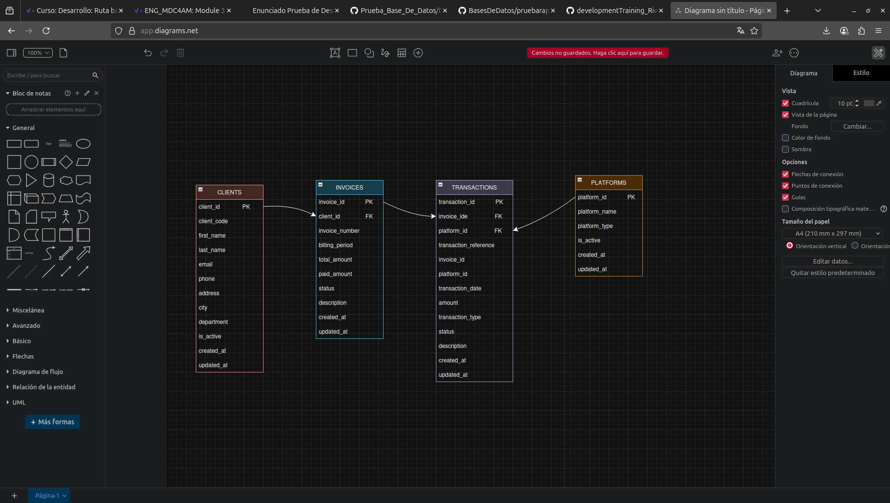

# Financial Data Management System - ExpertSoft

## Description
This system was developed for ExpertSoft, a software company that develops products for the electrical sector in Colombia. The system addresses the client's difficulties in managing financial information from Fintech platforms like Nequi and Daviplata by organizing and structuring this information in a SQL database. The project is built around the `data.xlsx` file containing 100 financial transaction records that have been normalized and converted to a structured database format.

## Developer Information
- **Name**: Salome Gonzalez Gomez
- **Clan**: Lovelace
- **Email**: Salogonzalez1211@gmail.com

## Technologies Used
- **Backend**: Node.js with Express.js
- **Database**: MySQL
- **Frontend**: HTML, CSS, JavaScript with Bootstrap
- **API Testing**: Postman
- **Database Design**: Draw.io

## Project Structure
```
desempeño/
├── data.xlsx                 # Original Excel data file
├── data.csv                  # Normalized CSV data file
├── normalize_data.py         # Data normalization script
├── analyze_data.py           # Data analysis script
├── backend/
│   ├── server.js
│   ├── routes/
│   │   ├── clients.js
│   │   ├── queries.js
│   │   └── data-loader.js    # Mass data loading functionality
│   ├── models/
│   └── config/
├── frontend/
│   ├── index.html
│   ├── css/
│   └── js/
├── database/
│   ├── schema.sql            # Updated database schema
│   └── sample_data.csv       # Sample data for testing
├── docs/
│   └── normalization_explanation.md
├── postman/
│   └── collection.json
└── README.md
```

## Database Normalization
The original Excel data has been normalized following the three normal forms:

### 1NF (First Normal Form)
- Eliminated repeating groups
- Ensured atomic values
- Created separate tables for entities

### 2NF (Second Normal Form)
- Removed partial dependencies
- Separated data into logical tables

### 3NF (Third Normal Form)
- Eliminated transitive dependencies
- Created normalized structure

### Entity relationship model (MER)




## Setup Instructions

### Prerequisites
- Node.js (v14 or higher)
- MySQL (v8.0 or higher)
- Git

### Installation
1. Clone the repository
2. Install dependencies:
   ```bash
   cd backend
   npm install
   ```
3. Configure the database:
   - Create MySQL database: `pd_salome_gonzalez_lovelace`
   - Run the schema.sql file
4. Start the server:
   ```bash
   npm start
   ```
5. Open frontend/index.html in your browser

## Data Processing and Loading

### Data Normalization
The original `data.xlsx` file has been processed through a normalization script (`normalize_data.py`) that:
- Applies 1NF, 2NF, and 3NF normalization rules
- Converts Spanish field names to English
- Parses client names into first and last names
- Separates addresses into street, city, and department
- Maps transaction statuses and types to standardized English values
- Generates unique client codes from identification numbers
- Calculates invoice status based on payment amounts

### CSV Data Loading
The system includes a comprehensive data loading mechanism that:
- Converts the normalized Excel data to CSV format (`data.csv`)
- Loads data into the normalized database structure
- Validates data integrity during the loading process
- Handles both new data insertion and existing data updates
- Provides detailed statistics on the loading process
- Supports both file upload and predefined data loading

## Advanced Queries
The system implements three key queries:

1. **Total paid per client**: Shows the total amount paid by each client
2. **Pending invoices**: Lists unpaid invoices with client and transaction information
3. **Transactions by platform**: Shows all transactions from a specific platform (Nequi/Daviplata)

## API Endpoints
- CRUD operations for clients
- Advanced query endpoints
- Data loading endpoint

## Postman Collection
The project includes a complete Postman collection with all endpoints for testing and documentation.

## Database Schema
The relational model is included as an image in the docs folder, showing the normalized structure of the database.

